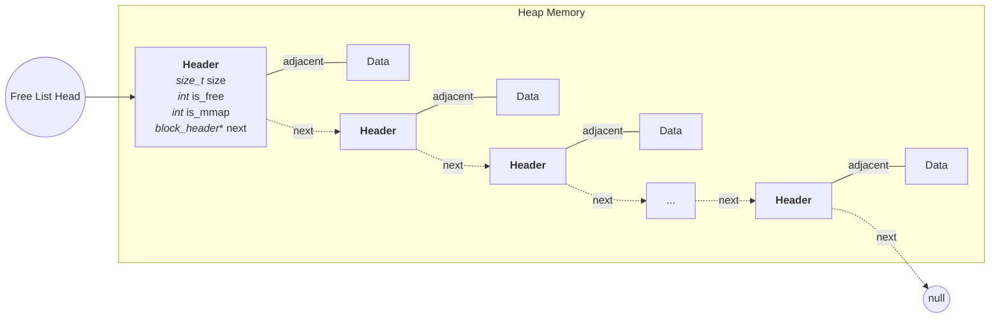

# Overview
A free list memory allocator written in C that implements `malloc`, `free`, `realloc`, and `calloc`. It supports two search strategies (first fit and best fit), coalesces adjacent free blocks on free, and splits oversized blocks during allocation. On Unix it uses `sbrk` for small allocations and `mmap` for large ones. On embedded platforms it runs against a static heap array with no OS dependencies. Includes a terminal based heap visualizer and a benchmark suite comparing both strategies.

# Architecture

Each block is a header struct immediately followed by the user data. When `malloc` returns a pointer, it returns `header + 1`. Pointer arithmetic advances past the header by exactly `sizeof(block_header_t)` bytes, landing at the start of the data region. When `free` receives that pointer back, it reverses the operation with `(block_header_t*)ptr - 1` to step back to the header and read the block metadata. The headers are linked together into a free list so the allocator can walk them to find reusable blocks.

The heap is laid out as follows: 



# API Reference

### `void* allocator_malloc(size_t size)`
Allocates `size` bytes of memory. Returns a pointer to the allocated block, or `NULL` on failure. Uses first fit strategy. Walks the free list and picks the first block that fits. Requests are 8 byte aligned. On Unix, allocations larger than 4000 bytes go through `mmap` instead of `sbrk`.

### `void* allocator_malloc_best_fit(size_t size)`
Same as `allocator_malloc`, but uses best fit strategy. Scans the entire free list and picks the smallest block that fits. Reduces fragmentation at the cost of a slower search.

### `void allocator_free(void* ptr)`
Frees a previously allocated block. If `ptr` is `NULL`, does nothing. On Unix, `mmap`'d blocks are unmapped and unlinked from the free list. After freeing, walks the list and coalesces adjacent free blocks.

### `void* allocator_realloc(void* ptr, size_t new_size)`
Resizes an existing allocation. If `new_size` fits in the current block, returns the same pointer. Otherwise allocates a new block, copies the data, and frees the old one. If `ptr` is `NULL`, behaves like `allocator_malloc`. Returns `NULL` if `new_size` is 0.

### `void* allocator_calloc(size_t n, size_t size)`
Allocates `n * size` bytes and zeroes the memory. Checks for overflow before allocating. Returns `NULL` on failure.

### `void* allocator_bump_allocator(intptr_t size)`
Low level allocator used internally. On Unix, wraps `sbrk`. On embedded, bumps an offset into a static heap array of `ALLOCATOR_HEAP_SIZE` bytes (default 8192).

### `void allocator_reset(void)`
Tears down the entire heap. Unmaps any `mmap`'d blocks (Unix only), then coalesces the remaining free list into a single free block. Used for cleanup between benchmark runs and tests.

### `void allocator_stats(void)` *(Unix only)*
Prints a visual map of the heap using Unicode box drawing and ANSI colors. Lists every block with its address, size, and status. Shows totals for used/free bytes, block counts, and fragmentation percentage.


# Design Decisions

**mmap threshold (4000 bytes)** — Any larger allocation goes through `mmap` instead of `sbrk`. This avoids pinning the heap even after the block is freed, since `sbrk` grows the heap as one contiguous region and can't release memory in the middle, while `mmap` gets pages from the OS that can be returned independently.

**Minimum split size (4 bytes)** — When splitting a free block, the remainder must be at least 4 bytes of usable space. Anything smaller risks fragmenting the heap into many tiny unusable blocks.

**8-byte alignment** — All allocations are aligned to 8 bytes. On most 64-bit systems, unaligned access to types like `size_t` or pointers can cause a performance penalty or even a bus error on stricter architectures (e.g. ARM). 8 bytes is the natural word size on 64-bit platforms and satisfies the alignment requirements of all standard C types.

# Benchmark Results

The benchmark allocates 20 blocks in an alternating pattern: 10 varied size blocks (64, 256, 128, 32, 512, 96, 48, 200, 80, 160 bytes) interleaved with 10 fixed 16-byte separator blocks. The even indexed blocks are freed, creating 10 holes of those sizes while the 16 byte separators stay allocated to prevent coalescing. It then runs 8 allocation requests (50, 120, 30, 200, 60, 40, 100, 24 bytes) through the fragmented list.

**Run times:**
First fit: 1.108s  Best fit: 1.255s

**Fragmentation (external):** 
First fit: 75% — Best fit: 41%

Fragmentation is measured as external fragmentation: $1 - \frac{\text{largest free block}}{\text{total free memory}}$. A value of 0% means all free memory is in one contiguous block. 100% means it's scattered into many tiny holes where no single one holds a meaningful share of the free space.

If we look at which holes could still service each request size after a run:

| Request Size | First Fit (fit/holes) | Best Fit (fit/holes) |
|-------------:|:---------------------:|:--------------------:|
| 24           | 7/7                   | 3/3                  |
| 30           | 7/7                   | 3/3                  |
| 40           | 6/7                   | 3/3                  |
| 50           | 5/7                   | 3/3                  |
| 60           | 5/7                   | 3/3                  |
| 100          | 3/7                   | 2/3                  |
| 120          | 3/7                   | 2/3                  |
| 200          | 1/7                   | 2/3                  |

This highlights that:
- First fit is around 13% faster since it grabs the first hole and moves on
- Best fit cuts fragmentation nearly in half (41% vs 75%) by keeping large holes intact
- First fit splits big holes early, leaving 7 small fragments where best fit leaves just 3 usable ones
- At 200 bytes, 2 of best fit's 3 holes still fit vs only 1 of first fit's 7

Use first fit when allocation speed matters and request sizes are fairly uniform. Use best fit when the workload has a wide range of sizes and you need large holes to stay available for bigger requests.

# Building and Running 

**Unix (default):**
```bash
make unit        # build and run unit tests
make bench       # build benchmark
./benchmark      # run benchmark
```

By default the allocator builds with `-DALLOCATOR_USE_UNIX`, which uses `sbrk` and `mmap`. You don't need to pass anything extra.

**Embedded:**
```bash
gcc -Wall -Wextra -g -DALLOCATOR_USE_EMBEDDED -o build/allocator allocator.c your_main.c
```

Pass `-DALLOCATOR_USE_EMBEDDED` to swap out `sbrk`/`mmap` for a static heap array. The heap size defaults to 8192 bytes but can be overridden:

```bash
gcc -DALLOCATOR_USE_EMBEDDED -DALLOCATOR_HEAP_SIZE=16384 ...
```

Note: `allocator_stats()` is only available on Unix builds since it depends on `printf` and ANSI escape codes.

# Known Limits

**Not thread safe** — The allocator uses a global `free_list` pointer with no locking. Concurrent access from multiple threads will corrupt the list.

**Cannot mix with system malloc** — On Unix, this allocator moves the program break with `sbrk`. If the system `malloc` is also used in the same process, both will move the break independently and corrupt each other's heap.
